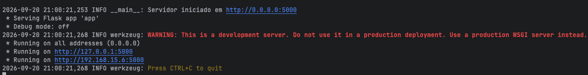
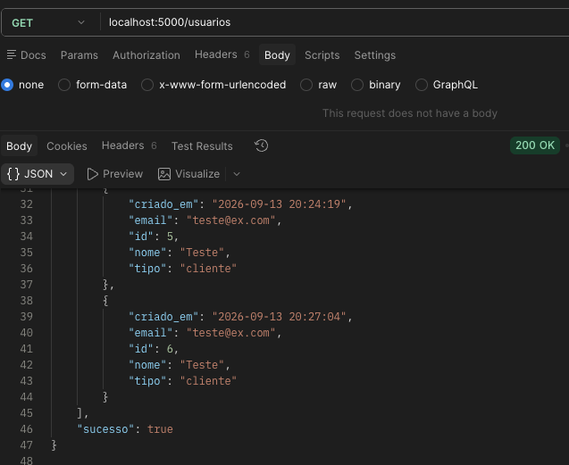
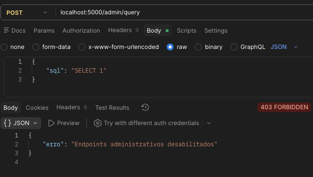
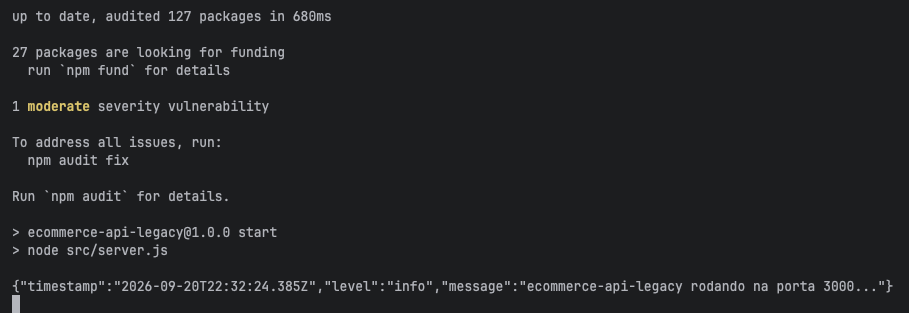
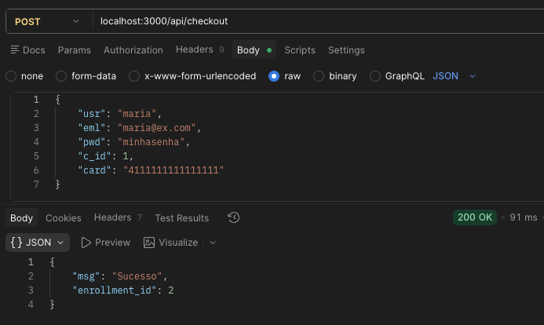
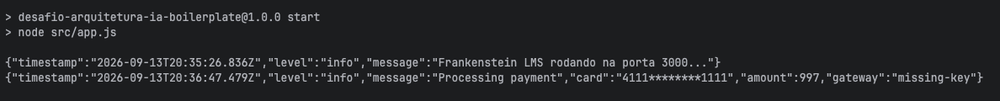
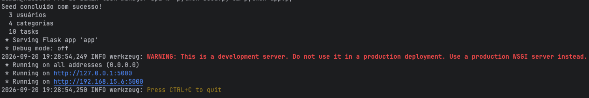
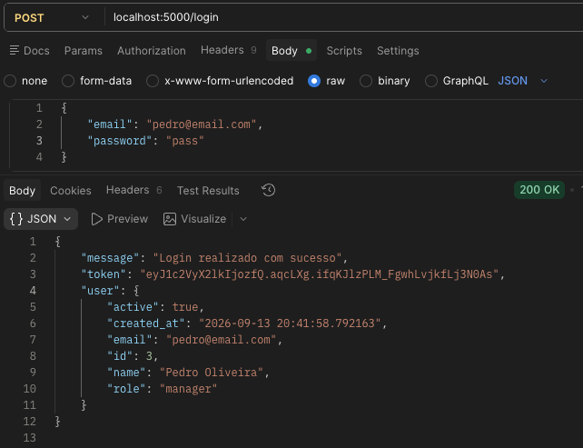
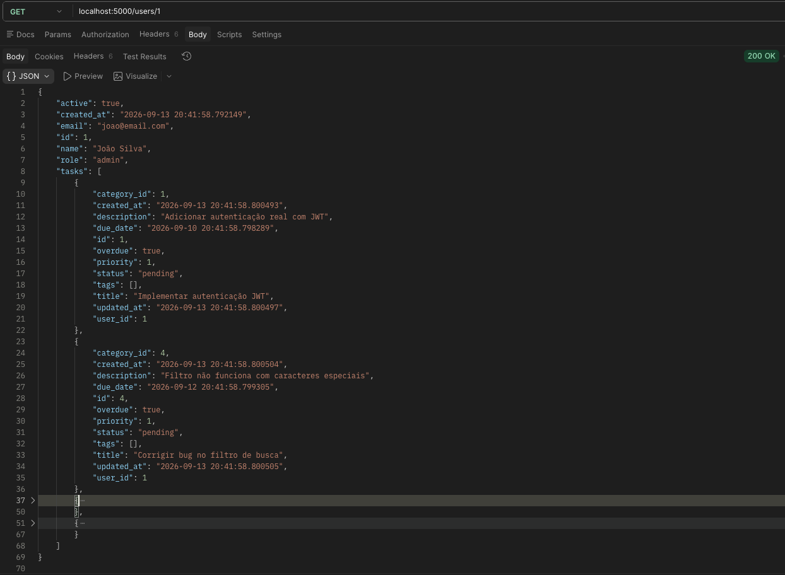
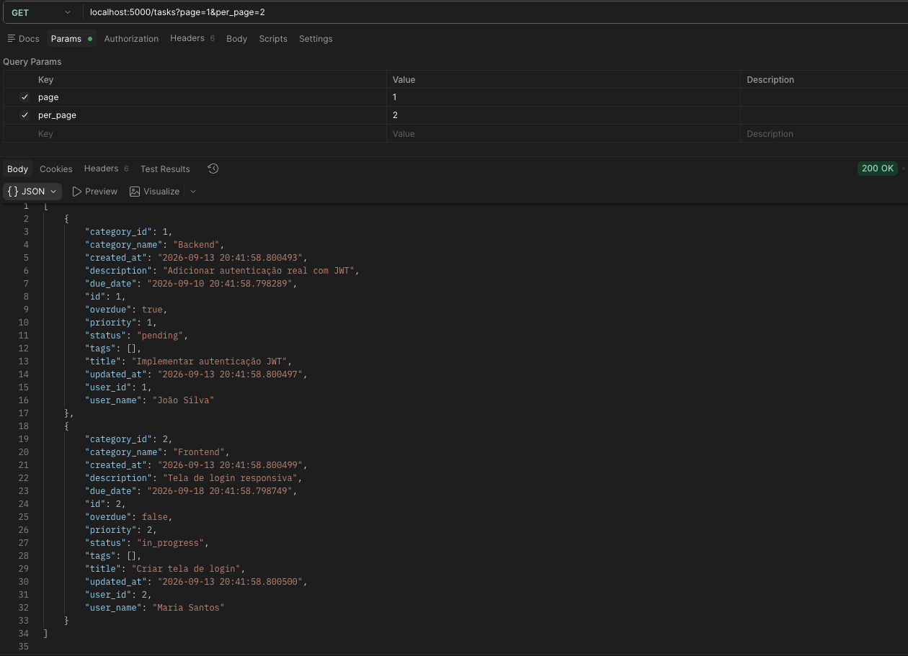

# Resultados

[← README](../README.md) · [Análise Manual](manual-analysis.md) · [Design da Skill](skill-design.md) · [Evolução do Uso de IA](ai-evolution.md) · [Estrutura do Projeto](project-structure.md) · [Enunciado Original](challenge-original.md)

> Auditorias completas, comparação antes/depois, checklist de validação (com as notas de rodapé narrativas), galeria completa de evidências e os dois postmortems de bugs encontrados após a entrega inicial. O resumo obrigatório, com a tabela consolidada de findings e o checklist condensado, está na [seção 3 do README](../README.md#3-resultados).

---

## Evidências de Execução

Comandos para reproduzir localmente a validação de cada projeto e capturar evidência (boot da aplicação + o endpoint que corrige o finding CRITICAL mais grave do respectivo relatório de auditoria). `code-smells-project` e `task-manager-api` usam a mesma porta padrão (5000) — rode um projeto por vez, ou sobrescreva a porta de um deles via variável de ambiente (`PORT`/`FLASK_PORT`).

**Projeto 1 — code-smells-project (porta 5000)**

```bash
cd code-smells-project
python app.py
```
Log esperado: `Servidor iniciado em http://0.0.0.0:5000`, sem `SECRET_KEY` impresso.



```bash
# senha não deve mais vazar na listagem de usuários (AP-04 / RP-09)
curl -s -X POST localhost:5000/usuarios -H "Content-Type: application/json" \
  -d '{"nome":"Teste","email":"teste@ex.com","senha":"123456"}' | jq
curl -s localhost:5000/usuarios | python3 -m json.tool
# → nenhum objeto deve conter a chave "senha"
```



```bash
# endpoint admin agora bloqueado por padrão, sem ADMIN_TOKEN configurado (AP-01 / RP-01)
curl -s -X POST localhost:5000/admin/query -H "Content-Type: application/json" -d '{"sql":"SELECT 1"}'
# → 403 {"erro":"Endpoints administrativos desabilitados"}
```



**Projeto 2 — ecommerce-api-legacy (porta 3000)**

```bash
cd ecommerce-api-legacy
npm install
npm start   # ou: node src/app.js
```
Log esperado: `Frankenstein LMS rodando na porta 3000...`.



```bash
# checkout não deve mais imprimir o cartão em texto plano no log do servidor (AP-02 / RP-02)
curl -s -X POST localhost:3000/api/checkout -H "Content-Type: application/json" \
  -d '{"usr":"maria","eml":"maria@ex.com","pwd":"minhasenha","c_id":1,"card":"4111111111111111"}'
# → conferir no terminal do servidor: nenhum número de cartão impresso
```





**Projeto 3 — task-manager-api (porta 5000)**

```bash
cd task-manager-api
python seed.py   # dados de exemplo, opcional
python app.py
```



```bash
# token de login real assinado, não mais "fake-jwt-token-<id>" (AP-02 / RP-02)
curl -s -X POST localhost:5000/login -H "Content-Type: application/json" \
  -d '{"email":"<email do seed>","password":"<senha do seed>"}' | python3 -m json.tool
```



```bash
# senha não deve mais vazar no detalhe de usuário (AP-04 / RP-09)
curl -s localhost:5000/users/1 | python3 -m json.tool
# → sem a chave "password"
```



```bash
# paginação funcionando (AP-09 / RP-07)
curl -s "localhost:5000/tasks?page=1&per_page=2" | python3 -m json.tool
```



### Logs de execução (evidência adicional em texto)

As 10 imagens acima cobrem só "a aplicação sobe depois da Fase 3". A tabela abaixo fecha o restante do que o enunciado pede em "Screenshots ou logs mostrando as aplicações rodando após refatoração" — saída de terminal real, transcrita literalmente em `evidence/logs/*.txt` (nenhum log foi escrito à mão ou reconstruído; ver [Lacunas de evidência](#lacunas-de-evidência) para o que ainda depende de uma execução interativa da skill).

| Log | O que prova |
|---|---|
| [`item3-arch-check-project-specific.txt`](../evidence/logs/item3-arch-check-project-specific.txt) | `PASS` do `arch-check.sh` específico de cada um dos 3 projetos |
| [`item4-arch-check-bundled-generic.txt`](../evidence/logs/item4-arch-check-bundled-generic.txt) | `PASS` do checker genérico empacotado pela skill (`scripts/arch-check.sh`) nos 3 projetos, mais um caso `INCONCLUSIVE` (exit 2) contra um diretório sem camada de rotas identificável |
| [`item5-manual-tests-project1.txt`](../evidence/logs/item5-manual-tests-project1.txt) | `manual-tests.sh` completo do code-smells-project — inclui a tentativa de SQL Injection no login sendo rejeitada |
| [`item5-manual-tests-project2.txt`](../evidence/logs/item5-manual-tests-project2.txt) | `manual-tests.sh` completo do ecommerce-api-legacy — checkout, relatório financeiro paginado, exclusão em cascata |
| [`item5-manual-tests-project3.txt`](../evidence/logs/item5-manual-tests-project3.txt) | `manual-tests.sh` completo do task-manager-api — login com token assinado (`<token>` saneado), paginação, todos os 22 endpoints |
| [`item6-go-gin-fail-current-checker.txt`](../evidence/logs/item6-go-gin-fail-current-checker.txt) | Re-execução do checker atual contra o repositório Go/Gin (`626c372`, clonado no scratchpad, não versionado aqui): `FAIL`, 26 chamadas de persistência inline — bate com o número citado na seção [Comportamento entre Diferentes Stacks](#comportamento-entre-diferentes-stacks) |
| [`item6-go-gin-false-pass-reproduction.txt`](../evidence/logs/item6-go-gin-false-pass-reproduction.txt) | **Reprodução do bug**, não a execução original: mesmo repositório Go, mas com o padrão de função livre desativado numa cópia do script — reproduz o falso `PASS` que motivou a correção. A versão que produziu o falso PASS original nunca foi commitada, então isto é uma recriação rotulada, não um log histórico |
| [`item7a-drop-table-blocked-project1.txt`](../evidence/logs/item7a-drop-table-blocked-project1.txt) | `DROP TABLE` bloqueado em `/admin/query` mesmo com token de admin válido — fecha o achado 1 da re-auditoria do code-smells-project |
| [`item9-project2-checkout-server-log.txt`](../evidence/logs/item9-project2-checkout-server-log.txt) | Log do servidor durante o checkout do projeto 2 — número de cartão sempre mascarado (`4111********4444`), nunca em texto plano |

O `PASS` do `arch-check.sh` de cada projeto (linha 1 da tabela acima) fecha também o fechamento do AP-16 no task-manager-api citado no [postmortem abaixo](#bug-encontrado-após-a-entrega).

### Lacunas de evidência

Dois itens do "Screenshots ou logs" do enunciado ainda dependem de uma execução interativa da skill e não foram capturados nesta passada:

1. **Blocos `PHASE 1/2/3` da skill rodando**, por projeto — a única prova hoje é o relatório já salvo em `reports/`.
2. **A Fase 2 parando e pedindo confirmação (`y`)** — a regra inegociável nº 1 do `SKILL.md`.

Ambos exigem rodar `claude "/refactor-arch"` interativamente e capturar o terminal; ficam como pendência explícita para revisão antes da entrega final.

## Resumo das Auditorias

| Projeto | CRITICAL | HIGH | MEDIUM | LOW | Total |
|---|---|---|---|---|---|
| code-smells-project | 4 | 3 | 2 | 4 | **13** |
| ecommerce-api-legacy | 4 | 2 | 2 | 4 | **12** |
| task-manager-api | 4 | 2 | 4 | 4 | **14** |

Todos os 3 projetos superam o mínimo exigido (≥5 findings, ≥1 CRITICAL/HIGH, ≥2 MEDIUM, ≥2 LOW).

Um quarto projeto, **externo ao repositório e em stack não coberta** (Go/Gin), foi auditado depois para testar a independência de tecnologia — 1 CRITICAL, 3 HIGH, 3 MEDIUM, 3 LOW, total **10**. Ele não faz parte da entrega dos 3 projetos legados e recebeu apenas as Fases 1 e 2; ver [seção Comportamento entre Diferentes Stacks](#comportamento-entre-diferentes-stacks) e `reports/audit-project-4.md`.

## code-smells-project

Relatório completo: [`reports/audit-project-1.md`](../reports/audit-project-1.md).

Principais achados e correções aplicadas na Fase 3 (commit [`1d8e0fa`](https://github.com/bianavic/mba-ia-refactor-projects-skill/commit/1d8e0fa)): SQL Injection generalizada em `models.py` → queries parametrizadas; endpoint `/admin/query` que executava SQL arbitrário sem autenticação → protegido por middleware `requer_admin`; `SECRET_KEY` hardcoded vazado via `/health` → movido para `config/settings.py` via variável de ambiente; senhas em texto plano armazenadas e devolvidas pela API → hashing + remoção do campo das respostas; conexão de banco global mutável → isolada em `models/db.py`; lógica duplicada, N+1 e ausência de paginação corrigidas nos novos `controllers/` e `models/`.

## ecommerce-api-legacy

Relatório completo: [`reports/audit-project-2.md`](../reports/audit-project-2.md).

Principais achados e correções (commit [`f5c6fca`](https://github.com/bianavic/mba-ia-refactor-projects-skill/commit/f5c6fca)): segredos de produção e chave de gateway de pagamento hardcoded → `src/config/index.js` via `.env`; hashing de senha falso (base64 repetido) → `scrypt`; número de cartão logado em texto plano → mascarado no logger estruturado (`src/utils/logger.js`); `AppManager` (God Class) → dividido em `models/`, `controllers/`, `services/`, `routes/`; exclusão de usuário sem cascata → cascata explícita no model; N+1 no relatório financeiro → consultas agrupadas.

**Vulnerabilidade de dependência conhecida (fora do escopo do catálogo de anti-patterns):** `npm audit` reporta 1 vulnerabilidade moderada em `qs` (DoS via `isBuffer`, [GHSA-4mjr-xmp4-gh2g](https://github.com/advisories/GHSA-4mjr-xmp4-gh2g)) — uma categoria diferente da que a skill audita (CVE de dependência de terceiros, não anti-pattern no código-fonte do projeto), por isso não consta em `reports/audit-project-2.md`.

**Status:** não corrigido automaticamente.

`npm audit fix` não resolve a vulnerabilidade porque `express@4.22.1` declara `qs: "~6.14.0"`, restringindo a resolução à série 6.14.x. A versão corrigida (`qs@6.16.0`) só é liberada a partir do `express@5.1.0`, que relaxa essa dependência para `qs: "^6.14.0"` — mas migrar de Express 4→5 é uma mudança de versão major, fora do escopo de uma refatoração estrutural que deve preservar 100% do comportamento observável, e exigiria validação de compatibilidade própria antes de ser aplicada.

## task-manager-api

Relatório completo: [`reports/audit-project-3.md`](../reports/audit-project-3.md).

Principais achados e correções (commit [`5ef74b3`](https://github.com/bianavic/mba-ia-refactor-projects-skill/commit/5ef74b3)): hash de senha MD5 sem salt → hashing do Werkzeug; hash de senha devolvido em toda resposta de usuário → removido da serialização pública; `SECRET_KEY`/credenciais SMTP hardcoded e `debug=True` em todas as interfaces → configuração via ambiente; token de login falso (`'fake-jwt-token-' + id`) → token assinado com `itsdangerous`; regra "task atrasada" duplicada em 6 lugares → centralizada em `Task.is_overdue()`; `notification_service` morto (nunca importado, com credenciais hardcoded) → removido; N+1 nos relatórios → consultas agregadas em `services/report_service.py` (camada nova); `datetime.utcnow()` deprecated (18 ocorrências) → substituído.

## Comparação Antes e Depois

**code-smells-project** — de 4 arquivos monolíticos para MVC completo:

```
Antes                        Depois
app.py                        app.py                       (composition root)
controllers.py                config/settings.py
models.py                     controllers/{admin,order,product,system,user}_controller.py
database.py                   models/{db,order,product,user}_model.py
                               middlewares/{auth,error_handler}.py
                               routes/routes.py
```

**ecommerce-api-legacy** — de 1 God Class para MVC completo:

```
Antes                         Depois
src/app.js                    src/app.js                   (composition root)
src/AppManager.js             src/config/index.js
src/utils.js                  src/controllers/{checkout,report,user}Controller.js
                               src/models/{auditLog,course,enrollment,payment,user}Model.js
                               src/services/{cache,paymentGateway}Service.js
                               src/middlewares/errorHandler.js
                               src/routes/index.js
                               src/utils/{crypto,logger}.js
```

**task-manager-api** — camadas já existentes, ajustadas *in place* (adições da Fase 3: `config/`, um novo service, e — no fechamento do bug da seção [Bug Encontrado Após a Entrega](#bug-encontrado-após-a-entrega) — `controllers/`):

```
Antes (parcial)                        Depois
app.py                                  app.py                        (SECRET_KEY/debug via env)
models/{user,task,category}.py          models/{user,task,category}.py (hashing correto, sem duplicação)
routes/{task,user,report}_routes.py     routes/{task,user,report}_routes.py (parse → 1 chamada de controller/service → resposta)
services/notification_service.py        controllers/{task,user}_controller.py (novo — fecha o AP-16, ver 5.8)
utils/helpers.py                        config/settings.py            (novo)
                                         services/report_service.py    (novo — agregação + CRUD de categorias)
                                         middlewares/error_handler.py  (novo — ajuste pós-Fase 3, ver 5.7 nota 4)
                                         (notification_service.py removido — código morto)
```

## Comportamento entre Diferentes Stacks

- **Python/Flask monolítico (`code-smells-project`):** a skill reconstruiu a árvore de diretórios do zero (config/models/controllers/routes/middlewares), já que não havia nenhuma separação prévia para preservar.
- **Node.js/Express monolítico (`ecommerce-api-legacy`):** mesma estratégia de reconstrução total, mas a implementação de cada camada seguiu as convenções idiomáticas de Node (callbacks/módulos CommonMark, `express.Router()`) em vez de espelhar literalmente a estrutura Python — confirmando que a detecção de stack (seção 3.6) direciona corretamente o `architecture-guidelines.md` para o bloco "Node.js / Express" em vez do bloco "Python / Flask".
- **Python/Flask parcialmente em camadas (`task-manager-api`):** a skill não recriou a estrutura de pastas — identificou corretamente que `models/routes/services/utils` já existiam e limitou a Fase 3 a mover lógica de negócio das rotas para o model/service correto, removendo apenas a camada morta (`notification_service.py`) e adicionando uma camada nova apenas onde não havia nenhuma equivalente (`report_service.py`). Esse foi o teste mais direto de que a regra "adaptar, não reconstruir" (seção 3.8) funciona na prática.
- Em todos os 3 casos, a mesma invocação (`claude "/refactor-arch"`) e o mesmo `SKILL.md` produziram um fluxo de 3 fases correto sem qualquer ajuste manual entre execuções — a única diferença entre projetos foi o conteúdo específico do relatório e da refatoração, nunca o processo.

### Teste em projeto externo — Go/Gin (`reports/audit-project-4.md`)

Os 3 projetos acima são Python/Flask ou Node/Express, então "funciona com qualquer stack de backend" continuava sendo uma afirmação não testada: as duas linguagens exercitadas são exatamente as duas para as quais o catálogo foi escrito. Para fechar essa lacuna, a skill foi executada num projeto **fora deste repositório**, em stack não coberta:

- **Alvo:** [gothinkster/golang-gin-realworld-example-app](https://github.com/gothinkster/golang-gin-realworld-example-app), commit `626c372` — Go 1.21, Gin 1.10, GORM 1.25, ~1 670 linhas.
- **Escopo:** Fases 1 e 2 apenas. A Fase 3 não se aplica a um codebase de terceiros; o código não foi alterado e o clone não foi versionado aqui.
- **Resultado:** 10 achados (1 CRITICAL, 3 HIGH, 3 MEDIUM, 3 LOW), todos com arquivo:linha verificado — segredo de assinatura JWT publicado no repositório, ausência total de camada de controller, handle de banco global e mutável, e erro do bcrypt descartado no caminho de hash de senha.

O valor real do teste não foi o relatório, e sim **o que ele quebrou**. A primeira execução do `arch-check` no projeto Go retornou **PASS com zero achados** — em arquivos de rota com 26 violações de AP-16. A causa: todos os padrões de detecção assumiam que a persistência é alcançada por um receptor (`Model.query`, `db.session.add`, `Model.findOne(...)`), que é como Python e Node expõem ORM. Go expõe como **funções de pacote** (`FindOneUser(...)`, `SaveOne(...)`), então nada casava e o arquivo era reportado como limpo.

Três correções saíram daí, e são a razão de essa auditoria estar no repositório:

1. `scripts/arch-check.sh` ganhou o padrão de função livre com verbo à frente, que produziu os 26 achados reais.
2. O AP-16 no catálogo passou a nomear explicitamente essa forma, para a Fase 2 procurá-la na leitura e não depender só do script.
3. `references/verification-recipes.md` documenta a regra de fundo — decidir se a stack expõe persistência como método ou função livre **antes** de escrever o padrão — e exige validar todo padrão novo contra uma violação conhecida, porque um padrão que nunca dispara não é evidência de código limpo.

Um falso PASS é pior do que nenhuma verificação: ele encerra a Fase 3 com um selo de aprovação. Por isso o checker agora sai com código 2 (INCONCLUSIVE) quando não identifica a camada de rotas, em vez de 0 — silêncio não é aprovação.

## Checklist de Validação Preenchido

Checklist da [seção 9.4](challenge-original.md#94-requisitos) ("Validação"), preenchido para cada projeto após a Fase 3. Cada item marcado é verificável no repositório (arquivo citado, relatório em `reports/` ou evidência em `evidence/`, seção 4.6).

**Projeto 1 — code-smells-project (Python/Flask)**

```markdown
### Fase 1 — Análise
- [x] Linguagem detectada corretamente         → Python
- [x] Framework detectado corretamente         → Flask 3.1.1 (+ flask-cors)
- [x] Domínio da aplicação descrito            → E-commerce (produtos, usuários, pedidos, itens_pedido)
- [x] Número de arquivos condiz com a realidade → 4 (app.py, controllers.py, models.py, database.py)

### Fase 2 — Auditoria
- [x] Relatório segue o template de referência  → reports/audit-project-1.md
- [x] Cada finding tem arquivo e linhas exatos  → ex.: models.py:28,47-50,109-111
- [x] Findings ordenados CRITICAL → LOW
- [x] Mínimo de 5 findings identificados        → 13 (4 CRITICAL · 3 HIGH · 2 MEDIUM · 4 LOW)
- [–] Detecção de APIs deprecated (se aplicável) → não aplicável: nenhuma API deprecated no código original
- [x] Skill pausa e pede confirmação antes da Fase 3

### Fase 3 — Refatoração
- [x] Estrutura de diretórios segue padrão MVC  → config/ models/ controllers/ routes/ middlewares/
- [x] Configuração extraída (sem hardcoded)     → config/settings.py (SECRET_KEY via env)
- [x] Models criados para abstrair dados        → models/{db,order,product,user}_model.py
- [x] Views/Routes separadas                    → routes/routes.py
- [x] Controllers concentram o fluxo            → controllers/{admin,order,product,system,user}_controller.py ⁵
- [x] Error handling centralizado               → middlewares/error_handler.py
- [x] Entry point claro                         → app.py (composition root)
- [x] Aplicação inicia sem erros                → evidence/project1-boot.png
- [x] Endpoints originais respondem             → seção 4.6 (evidence/project1-usuarios-sem-senha.png, project1-admin-bloqueado.png)
```

⁵ Na entrega original, `admin_controller.py` era exceção a este item: chamava `models.db.get_db()`/`cursor.execute()` diretamente, e o endpoint `POST /admin/query` continuava executando qualquer SQL enviado pelo cliente (a autenticação adicionada na Fase 3 cobria só a metade da recomendação original da seção [code-smells-project](#code-smells-project) acima). Uma segunda auditoria encontrou isso e mais 5 achados introduzidos pela própria Fase 3 — ver [seção Re-auditoria do code-smells-project](#re-auditoria-do-code-smells-project).

**Projeto 2 — ecommerce-api-legacy (Node.js/Express)**

```markdown
### Fase 1 — Análise
- [x] Linguagem detectada corretamente         → JavaScript / Node.js
- [x] Framework detectado corretamente         → Express 4.18.2
- [x] Domínio da aplicação descrito            → LMS com fluxo de checkout (cursos, matrículas, pagamentos)
- [x] Número de arquivos condiz com a realidade → 3 (src/app.js, src/AppManager.js, src/utils.js)

### Fase 2 — Auditoria
- [x] Relatório segue o template de referência  → reports/audit-project-2.md ¹
- [x] Cada finding tem arquivo e linhas exatos  → ex.: src/utils.js:2-6, src/AppManager.js:45
- [x] Findings ordenados CRITICAL → LOW
- [x] Mínimo de 5 findings identificados        → 12 (4 CRITICAL · 2 HIGH · 2 MEDIUM · 4 LOW)
- [–] Detecção de APIs deprecated (se aplicável) → não aplicável: nenhuma API deprecated no código original
- [x] Skill pausa e pede confirmação antes da Fase 3

### Fase 3 — Refatoração
- [x] Estrutura de diretórios segue padrão MVC  → src/{config,models,controllers,services,routes,middlewares,utils}
- [x] Configuração extraída (sem hardcoded)     → src/config/index.js + .env (.env.example versionado)
- [x] Models criados para abstrair dados        → src/models/{auditLog,course,enrollment,payment,user}Model.js
- [x] Views/Routes separadas                    → src/routes/index.js (express.Router)
- [x] Controllers concentram o fluxo            → src/controllers/{checkout,report,user}Controller.js
- [x] Error handling centralizado               → src/middlewares/errorHandler.js (app.use na app.js)
- [x] Entry point claro                         → src/app.js (composition root)
- [x] Aplicação inicia sem erros                → evidence/project2-boot.png
- [x] Endpoints originais respondem             → seção 4.6 + api.http (evidence/project2-checkout-sem-cartao.png e -log.png)
```

¹ O relatório do projeto 2 traz cabeçalhos extras de agrupamento (`## HIGH`, `## MEDIUM`, `## LOW`) que não existem no `audit-report-template.md` nem nos relatórios 1 e 3. É uma variação cosmética da saída daquela execução; a estrutura obrigatória (cabeçalho, `## Summary`, blocos de finding com File/Description/Impact/Recommendation, total e prompt de confirmação) está integralmente presente, e o arquivo foi mantido como a saída literal da Fase 2, sem edição posterior.

**Projeto 3 — task-manager-api (Python/Flask, parcialmente em camadas)**

```markdown
### Fase 1 — Análise
- [x] Linguagem detectada corretamente         → Python
- [x] Framework detectado corretamente         → Flask 3.0.0 + Flask-SQLAlchemy 3.1.1
- [x] Domínio da aplicação descrito            → Task Manager (tasks, users, categories, reports)
- [x] Número de arquivos condiz com a realidade → 15 arquivos .py (app.py, database.py, seed.py + models/ routes/ services/ utils/)

### Fase 2 — Auditoria
- [x] Relatório segue o template de referência  → reports/audit-project-3.md
- [x] Cada finding tem arquivo e linhas exatos  → ex.: models/user.py:27-32, routes/user_routes.py:210
- [x] Findings ordenados CRITICAL → LOW
- [x] Mínimo de 5 findings identificados        → 14 (4 CRITICAL · 2 HIGH · 4 MEDIUM · 4 LOW)
- [x] Detecção de APIs deprecated incluída      → [MEDIUM] datetime.utcnow() em 18 ocorrências
- [x] Skill pausa e pede confirmação antes da Fase 3

### Fase 3 — Refatoração
- [x] Estrutura de diretórios segue padrão MVC  → camadas existentes mantidas (models/ routes/ services/ utils/) + config/ novo ²
- [x] Configuração extraída (sem hardcoded)     → config/settings.py (SECRET_KEY, DEBUG, HOST, PORT via env)
- [x] Models criados para abstrair dados        → models/{user,task,category}.py (regra de negócio movida para cá)
- [x] Views/Routes separadas                    → routes/{task,user,report}_routes.py (blueprints)
- [x] Controllers concentram o fluxo            → controllers/{task,user}_controller.py + services/report_service.py ³
- [x] Error handling centralizado               → middlewares/error_handler.py ⁴
- [x] Entry point claro                         → app.py (registra blueprints, config e error handlers)
- [x] Aplicação inicia sem erros                → evidence/project3-boot.png
- [x] Endpoints originais respondem             → seção 4.6 (evidence/project3-login-token.png, project3-users-sem-senha.png, project3-tasks-paginacao.png)
```

² Conforme a regra "Partially-layered projects" do `architecture-guidelines.md` (seção 3.8): projeto que já tem camadas não é reconstruído do zero — a Fase 3 corrigiu as responsabilidades dentro das camadas existentes em vez de renomear pastas.

³ Na entrega original, este projeto não tinha ganhado uma pasta `controllers/` — a separação vinha só de mover a regra de negócio das rotas para `models/`/`services/`, com o blueprint ainda chamando `Task.query`/`db.session.*` diretamente (ver o bug descrito na seção [Bug Encontrado Após a Entrega](#bug-encontrado-após-a-entrega)). Isso foi corrigido depois: `controllers/task_controller.py` e `controllers/user_controller.py` agora concentram parse → validação → persistência para tasks e usuários, e `services/report_service.py` foi estendido para cobrir também o CRUD de categorias — os blueprints ficaram só com parse do request → uma chamada → resposta, fechando o `arch-check.sh` (seção [Bug Encontrado Após a Entrega](#bug-encontrado-após-a-entrega)).

⁴ Este foi o único item do checklist que a Fase 3 original não entregou: o projeto tratava erros com `try/except` repetido rota a rota, e a skill preservou esse padrão em vez de centralizá-lo. O handler central foi adicionado depois, em ajuste manual de fechamento da entrega, para alinhar o projeto 3 aos outros dois — ele converte `HTTPException` e exceções não tratadas em JSON preservando os status codes originais (404, 405, 400, 500), sem alterar nenhuma resposta já existente nas rotas.

## Bug Encontrado Após a Entrega

**O bug.** A primeira refatoração do `task-manager-api` (commit [`5ef74b3`](https://github.com/bianavic/mba-ia-refactor-projects-skill/commit/5ef74b3)) manteve chamadas de persistência (`.query()`, `db.session.*`, `Model.get_by_id()`) direto nas rotas, mesmo já existindo `models/`, `routes/` e `services/`. O caso mais claro era `report_routes.py:16`, que chamava `User.get_by_id(user_id)` sem passar por nenhuma camada intermediária.

**Causa raiz (dupla).** O `architecture-guidelines.md` liberava explicitamente rotas com persistência inline em projetos já em camadas: a regra "Partially-layered projects" mandava não criar `controllers/` quando as rotas "já cumprem esse papel", e o critério para "já cumprem" era ausência de *duplicação* (AP-06), não ausência de acesso a dados. Como as queries eram únicas por rota, a regra deixava de ser uma permissão e virava uma proibição de criar o controller. Somado a isso, o catálogo de anti-patterns não tinha nenhuma entrada para o padrão — então a Fase 2 sequer o reportava como finding.

**Por que a validação não pegou.** A validação seguiu o [checklist da seção 9.4](challenge-original.md#94-requisitos), preenchido projeto a projeto na [seção Checklist de Validação Preenchido](#checklist-de-validação-preenchido), e cada projeto tem um `manual-tests.sh` na sua própria pasta cobrindo todos os endpoints reais via HTTP (sucesso, validação, 404/409 e os casos de segurança citados no respectivo relatório de auditoria). Mas esses são testes de caixa-preta: a resposta HTTP de uma rota que consulta o ORM diretamente é idêntica à de uma rota que delega a um controller/service. As evidências da seção [Evidências de Execução](#evidências-de-execução) têm a mesma limitação. O bug só apareceu em revisão externa do código.

**Correção aplicada.**

1. `architecture-guidelines.md` — a exceção foi removida: chamada de ORM/query dentro de rota é sempre violação de Views/Routes, inclusive em projeto que já tem camadas.
2. `anti-patterns-catalog.md` — criado o **AP-16 (Persistence/ORM Calls Inline in Routes)**, severidade HIGH, que cobre também finders de Model (`Model.get_by_id`, `Model.find_by_x`), não apenas ORM cru. Entrou como HIGH porque é violação forte de MVC pela escala da 8.2 — como LOW, seria detectado e despriorizado no mesmo relatório.
3. `SKILL.md` — a checagem virou passo obrigatório da Fase 3 (passo 3.6) nas 3 cópias vendorizadas da skill, para que execuções futuras não dependam nem de o catálogo citar o padrão exato nem de revisão humana. É um passo mecânico, não um julgamento da IA.
4. `refactoring-playbook.md` — criado o **RP-14 (Move persistence out of routes)**, com o antes/depois da transformação, para que a Fase 3 não tenha que reinventar a correção.
5. `arch-check.sh` — a mesma checagem mecanizada, um script por projeto, ao lado do `manual-tests.sh` de cada um: o `manual-tests.sh` prova o comportamento via HTTP, o `arch-check.sh` prova a estrutura lendo o código. Sai com código diferente de zero em qualquer ocorrência.

```bash
cd code-smells-project    && ./arch-check.sh
cd ../ecommerce-api-legacy && ./arch-check.sh
cd ../task-manager-api     && ./arch-check.sh
```

**Status.** Os 3 projetos passam. O `task-manager-api` foi o último a fechar: as rotas foram refatoradas para `controllers/task_controller.py`, `controllers/user_controller.py` e `services/report_service.py` (categorias), e `./arch-check.sh` agora retorna `PASS: no route in task-manager-api touches persistence directly.` — auditoria de acompanhamento em [`reports/audit-project-3-part2.md`](../reports/audit-project-3-part2.md).

## Re-auditoria do code-smells-project

**O que motivou.** Uma segunda execução da Fase 2 no `code-smells-project`, feita após a entrega original (seção [code-smells-project](#code-smells-project) acima), revisitou os 13 achados de então e encontrou que dois dos CRITICAL/HIGH tinham sido corrigidos só pela metade, além de 5 achados novos — introduzidos pela própria Fase 3, não pelo código original.

**Achados que sobreviveram parcialmente à Fase 3 original.**
1. **[CRITICAL]** `POST /admin/query` — a correção original só adicionou autenticação (`requer_admin`); qualquer chamador com o token continuava podendo executar SQL arbitrário, incluindo `DROP TABLE` ou exclusão em massa.
2. **[HIGH]** `admin_controller.py` continuava chamando `models.db.get_db()`/`cursor.execute()` diretamente — a mesma violação de "Controllers concentram o fluxo" da seção [Checklist de Validação Preenchido](#checklist-de-validação-preenchido), só que movida de `app.py` (entrega original) para dentro do controller, sem nunca ter passado por um model.

**Achados novos, introduzidos pela própria Fase 3.**
3. **[HIGH]** paginação (`page`/`per_page`) reimplementada de forma idêntica em 3 controllers (`product`, `order`, `user`) em vez de um helper compartilhado.
4. **[MEDIUM]** N+1 na criação de pedidos — `order_model.criar()` buscava um produto por item em vez de uma query `IN (...)`.
5. **[MEDIUM]** `/produtos/busca` sem paginação, ao contrário de `/produtos`.
6. **[LOW]** limiares/taxas de desconto do relatório de vendas hardcoded na função.
7. **[LOW]** parâmetro `id` sobrescrevendo o builtin do Python em 3 handlers de produto.

**Por que a validação original (seção [Checklist de Validação Preenchido](#checklist-de-validação-preenchido)) não pegou isso.** O [checklist da seção 9.4](challenge-original.md#94-requisitos) valida uma execução da Fase 2 seguida de uma Fase 3 — não prevê uma segunda passada para confirmar que a correção resolveu o espírito da recomendação, não só a letra. O achado 1 é o mesmo tipo de lacuna descrita na seção [Bug Encontrado Após a Entrega](#bug-encontrado-após-a-entrega) para o projeto 3: a recomendação original dizia "delete estes endpoints, ou proteja com autenticação **e** nunca exponha execução de SQL bruto sobre HTTP" — a Fase 3 aplicou a primeira parte e ignorou a segunda. Os achados 3-7 simplesmente não existiam na auditoria original: foram introduzidos pela refatoração (paginação nova, endpoint de busca novo), então só uma re-auditoria depois da Fase 3 poderia pegá-los.

**Correção aplicada.**
1. `models/admin_model.py` criado — `reset_database()` e `executar_query()` movidos para lá; `executar_query()` agora rejeita qualquer instrução que não comece com `SELECT`.
2. `controllers/admin_controller.py` — não importa mais `models.db`; delega tudo ao model novo.
3. `utils/pagination.py` criado com `parse_pagination()`; os 3 controllers passaram a usá-lo em vez de reimplementar o parsing.
4. `models/order_model.py` — `criar()` busca todos os produtos em uma única query `WHERE id IN (...)` em vez de uma por item.
5. `models/product_model.py` / `controllers/product_controller.py` — `buscar()` (endpoint `/produtos/busca`) ganhou `page`/`per_page`.
6. `config/settings.py` — faixas de desconto extraídas para `FAIXAS_DESCONTO_FATURAMENTO`.
7. `routes/routes.py` / `controllers/product_controller.py` — parâmetro `id` renomeado para `produto_id`.

Relatório completo da re-auditoria: [`reports/audit-project-1-part2.md`](../reports/audit-project-1-part2.md).

```bash
cd code-smells-project
./arch-check.sh
# PASS: no route in code-smells-project touches persistence directly.

# SQL destrutivo agora é bloqueado mesmo com token de admin válido:
curl -s -X POST http://localhost:5000/admin/query -H "X-Admin-Token: <token>" \
  -H "Content-Type: application/json" -d '{"sql":"DROP TABLE produtos"}'
# {"erro":"Somente instruções SELECT são permitidas nesta ferramenta"}
```

**Status.** Os 7 achados fechados; `manual-tests.sh` e `arch-check.sh` passam sem regressão; nenhum endpoint (método + caminho) mudou — o único comportamento alterado foi o caminho destrutivo de `/admin/query`, que era justamente o objetivo da correção.

